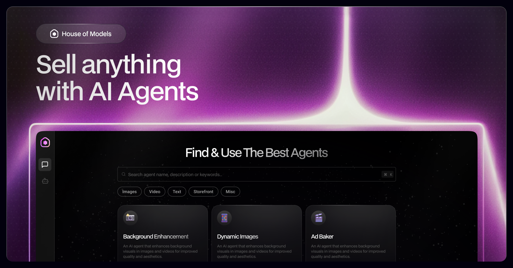
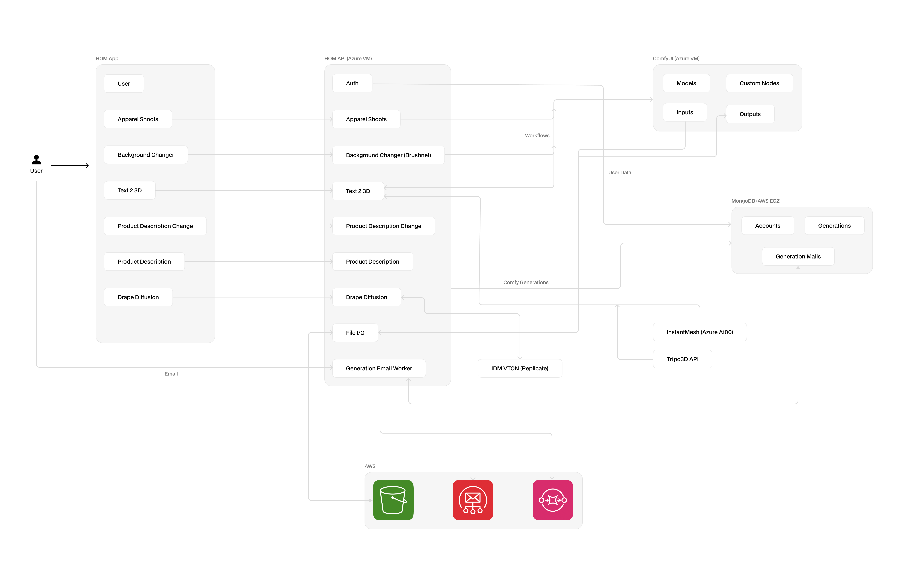

# Readme

# 🛍️🤖 Shop OS

Shop OS is an open-source platform that lets developers to build, deploy, and manage AI-powered agents for automating ecommerce store operations. It provides a comprehensive suite of tools and APIs to create custom AI workflows tailored to specific ecommerce needs.

It’s like having 50 interns working on helping you sell better.



---

## 📚 Table of Contents

- [🎁 What's inside?](#)
- [🥞 Tech Stack](#)
- [🏗️ Architecture Overview](#)
- [📂 Folders Overview](#)
    - [📄 docs](#)
    - [🧩 additional-APIs](#)
        - 🎭 [roop](#)
        - [📝 product-description](#)
        - 🕸️ [text-to-3d](#)
        - [👗 ootd](#)
    - [🧠 backend](#)
    - [💅 frontend](#)
- [🎨 Design Files and Prototypes](#)
- [🚀 How to Setup and Run](#)
    - [⚙️ Backend Setup](#)
    - [🖌️ Frontend Setup](#)
- [🤝 Contributing](#)
- [⚖️ License](#)

---

## 🎁 What's inside?

- 🛒 AI Agents + eCommerce + Automation
- 🧠 Powerful tools and APIs for custom AI workflows
- 🎨 Seamless integration with a design system
- Easy deployment on AWS, Azure, or wherever we could find those precious GPUs! 😅

---

## 🥞 Tech Stack

Took us a while to cook this up, takes you minutes to sell with it:

### **Frontend**

- **Next.js**
    - Server-rendered React framework. Enables improved performance, SEO benefits, and faster initial page loads. Used for creating dynamic, data-driven pages and handling routing.
- **Lobe UI**
    - Custom UI framework inspired by [Lobe Chat](https://lobechat.com/welcome). Provides a streamlined design and development experience, making it easier to build and maintain user interfaces.

### **Backend**

- **Python**
    - Core backend language. Utilized for building AI-driven ecommerce agents, APIs, and microservices. It supports scalable backend processes and handles most of the business logic.
- **ComfyUI**
    - An open-source UI for managing image-based workflows. It is integrated for creating and managing image generation, manipulation, and rendering tasks. Supports modular workflow design, allowing for flexibility and reusability.

### **Additional APIs**

- **Python APIs**
    - Python-based APIs are integrated to extend functionality. These include automation tasks, generation requests, image processing, and communication between the frontend and backend.

### **Design System**

- **Lobe UI**
    - The design system ensures consistency in UI/UX. Lobe UI is optimized for responsiveness and ease of use, enabling a cohesive experience across different components.

### **Deployment**

- **AWS and Azure**
    - Deployed on cloud infrastructure to leverage GPU availability. These platforms handle the scaling, compute power, and storage required to process heavy AI-driven workloads, ensuring low latency and high availability.

---

## 🏗️ Architecture Overview

Let’s get into how Shop OS is built. We’ve combined user interaction, AI power, and cloud infrastructure to create a seamless ecommerce machine.

### 👥 User Interaction

- **Auth →** Simple access control. Only users with the right credentials get in.
- **Approval Shoots →** Approve product shots before they go live.
- **Background Changer →** Swap out dull backgrounds for something fresh and relevant.
- **Text to 3D →** Generate a 3D preview of your products from text descriptions.
- **Product Description →** Auto-generate product descriptions that fit your brand.
- **Drape Diffusion →** Preview your products on virtual models or yourself.
- **File I/O →** Efficiently handle and store your files.

### 🎡 System Workflow

- **Models and Custom Nodes →**
    - **Models →** AI engines (LLMs, Diffusers) that do the heavy lifting for product generation and optimization.
    - **Custom Nodes →** Specialized operations that fit unique ecommerce needs.
- **Accounts and Generations →** User management and AI content generation.
- **Generation Mails →** Automatically send updates and notifications to users.

### ☁️ Cloud Services Integration

- **S3 →** Store assets and data securely in the cloud.
- **SES →** Email service for sending notifications and updates.
- **SQS →** Queue system that keeps processes in order and on schedule.
- **Generation Email Worker →** Handles email automation for generation-related tasks.

### 🧰 Additional Components

- **IVM VTON →** Virtual try-on for clothing, powered by deep learning.
- **InstantMesh →** Generates high-quality 3D textures for your products.
- **Tripo3D API →** Provides stunning 3D visualization for enhanced product displays.

This setup makes sure your ecommerce operations run smooth, while AI does the hard work behind the scenes.

## 🎬 Let’s see how it all comes together!

1. **You start by approving shoots, changing backgrounds, or updating descriptions**.
    
    You control what your storefront looks like, and the system takes your decisions to the next step.
    
2. **The system kicks into action**.
    
    It processes 2D images, runs the drape diffusion model, and optimizes product descriptions for maximum engagement.
    
3. **Generation Email Worker** ensures you're updated.
    
    Every move gets tracked, and you’ll receive automatic updates via email. No surprises, just smooth workflows.
    
4. **Your files are safely stored in S3**.
    
    With secure cloud storage, all your assets are backed up and easily accessible.
    
5. **For advanced tasks**, like virtual try-on or 3D rendering, tools like InstantMesh, IVM VTON, and Tripo3D API are activated.
    
    These components handle the complex tasks, ensuring a seamless virtual try-on or product visualization experience.
    
6. **Open-source AI models and workflows keep improving your results**.
    
    They run behind the scenes, continuously making your products look better and more engaging.
    

And there you have it, the core workflow behind Shop OS! 🚀



---

## 🎉 Features

Here’s what Shop OS brings to the table for your ecommerce success:

### 🔐 Authentication

- **Social Media Login →** Allow users to sign in quickly with their favorite platforms.

### 🧩 Modular Architecture

- **Plug and Play →** Integrate external tools like [Gradio](https://www.gradio.app/) or [ComfyUI](https://github.com/comfyanonymous/ComfyUI) without hassles.

### 🤖 Pre-built Agents

- **Scene Generator →** Create product scenes by placing objects to visualize items in a real-world context.
- **Confidence Score →** Compare images and text to ensure descriptions align with the visual content.
- **Copywriter →** Automatically generate product descriptions that resonate with your audience.
- **Product Enhancement →** Generate an unlimited variety of backgrounds to highlight your products.
- **Product Video Generator →** Create dynamic product videos designed for maximum social media engagement.
- **Product Voiceover →** Add voiceovers to your videos, giving your products a personal touch.
- **Talking Avatars →** Generate digital avatars that can present products or engage with customers.
- **Text to 3D →** Turn text descriptions into fully rendered 3D models.
- **Drape Your Dress →** Show customers how they’ll look in your products with personalized images.

These features combine to elevate your ecommerce store’s engagement and overall shopping experience.

### 🎨 Image Manipulation

- ✨ **Dynamic Masks →** Select and view masks on top of images using [SAM](https://segment-anything.com) and [Grounding DINO](https://huggingface.co/docs/transformers/en/model_doc/grounding-dino) models for a whole new level of customization.

### 💬 Conversation-first UI

- 🗣️ **Chatty Interface →** Engage with your customers like never before through our conversation-driven UI.

### 🖼️ Gallery

- 🖌️ **Previous Outputs →** Easily view and manage your past creations in one convenient location.

### 📊 Analytics Dashboard

- 📈 **Compute Usage →** Keep tabs on your compute usage and times to optimize your resources.

### 💳 Integrated Credit System

- 🪙 **User Credits →** Manage user access and allocate credits for a seamless user experience. This system can easily be extended to payment module

|  |  |  |
|--|--|--|
||||
||||
||||

---

## 🔍 Code Overview

Let's dive into the Shop OS codebase and explore how each part functions. Everything is neatly organized into folders for ease of use and scalability.

### 🧩 additional-apis

These APIs extend the capabilities of the core Shop OS system, enhancing ecommerce functionalities with additional tools and features.

**😎 roop** 

- **Face Swap API**
    
    This Python-based Flask API handles face-swapping using deep learning techniques. It allows users to swap faces in images, making it useful for ecommerce applications where visual personalization is key.
    
- **Tech Stack**
    
    Python, Flask
    

**📝 product-description** 

- **Image Descriptions**
    
    This FastAPI service automatically generates detailed and relevant descriptions for your product images, improving SEO and user engagement.
    
- **Multilingual Translations**
    
    Expand your market reach by providing product descriptions in multiple Indian languages using AWS Translate. This allows you to localize your ecommerce store and cater to a broader audience.
    
- **Deployment**
    
    The system is deployed on Azure VMs with AWS SQS handling the translation queue, ensuring scalability and reliable performance.
    
- **Tech Stack**
    
    Python, FastAPI, AWS Translate, Llava model
    

**🗿 text-to-3d** 

- **Text-to-3D**
    
    This Python-based WSGI API turns text-based descriptions into 3D models. It’s powered by the TripoSR model, making it easier to visualize products in three dimensions from simple text inputs.
    
- **Tech Stack**
    
    Python, WSGI, TripoSR
    

**👗 ootd** 

- **TripoSR Wrapper**
    
    This FastAPI service wraps the ootd vton model, enabling easy integration with other systems for generating images of users wearing a garment.
    
- **Tech Stack**
    
    Python, FastAPI, OOTD
    

### 🧠 backend

The backend is the engine that powers all of Shop OS’s advanced features, managing everything from authentication to data handling.

- **Authentication API**
    
    Secure your ecommerce operations with robust authentication and token-based authorization mechanisms. This API ensures that only authorized users have access to sensitive operations.
    
- **ComfyUI Communication API**
    
    This API allows seamless integration with ComfyUI, making it easy to handle tasks like apparel shoots, background changes, and image composition.
    
- **External Integrations**
    
    Connect with third-party services like Tripo3D and IDM VTON for extended functionality, such as 3D rendering and virtual try-ons.
    
- **Comfy Workflows**
    
    Customize workflows for apparel shoots, image backgrounds, and compositing with ease using ComfyUI's flexible integration.
    
- **Data Management API**
    
    This API organizes input and output data, making it easily accessible for other services or users. Efficient data handling is crucial for smooth system performance.
    
- **Email Background Worker**
    
    Keep users updated on their content generation processes with automated email notifications. This service ensures no one is left out of the loop.
    
- **Detailed API Docs**
    
    For in-depth information about each API, refer to our [API documentation](https://github.com/houseofmodels/shop-os/blob/main/docs/api.md).
    
- **Tech Stack**
    
    Python, Flask, ComfyUI, Azure, AWS
    

### 💅 frontend

The frontend is where users interact with the magic of Shop OS. Built to be intuitive and efficient, it powers the user experience.

- **Deployment**
    
    Hosted on Vercel, the frontend benefits from analytics integrations with Sentry, Smartlook, and Google Analytics to track user interaction and performance.
    
- **Frontend Setup Guide**
    
    Need to get up and running? Check out our detailed [frontend setup guide](https://github.com/houseofmodels/shop-os/blob/main/docs/frontend.md) for step-by-step instructions.
    
- **Tech Stack**
    
    Next.js, TypeScript, LobeUI, Fabric.js
    

This structure ensures that Shop OS remains modular, scalable, and easy to maintain, while also providing developers with the flexibility to customize and extend the system as needed.

---

**How to Setup and Run**

**Backend Setup**

1. Create a virtual environment:
    
    ```
    python3 -m venv env
    source env/bin/activate
    ```
    
2. Install the dependencies:
    
    ```
    pip install -r requirements.txt
    ```
    
3. Run the API server:
    
    ```
    python3 wsgi.py
    ```
    

**Frontend Setup**

1. Install dependencies using **bun**:
    
    ```
    bun install
    ```
    
2. Start the app locally:
    
    ```
    bun run dev
    ```
    
3. For deployment, push to the appropriate branch (`devtest` or `staging`) for automatic deployments on Vercel.

---

## 🎨 Design Files and Prototypes

We believe in open design. Here’s how you can explore and leverage our design process to inspire and create your own ecommerce experiences.

### 🌐 Figma Community File 🌐

We've built a UI for all agents here and it's ready for you to experiment with! You can dive into our **Figma Community File** to explore all the elements that make our interface sleek and functional. Use it to understand how we approached design and maybe even make it your own.

[Check out the Figma Community File here](https://www.figma.com/design/ig3sfz89UmKFwNAcM4OYaG/StoreGPT-Open-Source?node-id=4-2&t=HoeZbfNoH12kJoyh-1).

---

## 🎩✨ Tips and Tricks

While working on Shop OS, we’ve picked up a few handy tricks. 
Here are some insider tips to help you make the most out of your Shop OS experience.

### 🚀 Stay Up-to-Date with MLOps Pipelines

Always ensure your **MLOps pipelines** are up-to-date. Keeping them current helps you implement the latest AI models and workflows seamlessly, giving your project a boost in performance.

### 🎉 Be the First to Implement New AI Models

Stay ahead by keeping track of new AI model releases. With Shop OS, you can implement the newest models faster than your competition, bringing cutting-edge tech to your projects early.

### 🛋️ Test and Create Comfy Workflows

**Shop OS** is perfect for experimenting. Use **ComfyUI** to design custom workflows that fit your unique needs. It's your playground to push boundaries and innovate with creative solutions.

### 🏋️‍♀️ Offload Backend Work with [ComfyDeploy](https://www.comfydeploy.com/)

Use **ComfyDeploy** to manage backend processes. Offloading backend work helps you focus on building the front-end experiences while relying on a powerful system to handle the rest.

### 📅 Keep Your Models Up-to-Date

To ensure the best performance, always work with the latest models. Regularly updating your models will give your Shop OS setup the edge it needs to stay competitive.

---

## **Contributing**

Want to contribute to Shop OS? We’d love your help! 
Please review our [Contributing Guidelines](https://github.com/houseofmodels/shop-os/blob/main/CONTRIBUTING.md) before submitting any issues or pull requests.

---

## **License**

This project is licensed under the MIT License. 
Please see the [LICENSE](https://github.com/houseofmodels/shop-os/blob/main/LICENSE) file for details.

---

## **Support**

For any questions or feature requests, please [open an issue](https://github.com/houseofmodels/shop-os/issues) on GitHub or join our [Discord community](#).

Stay connected and follow us for the latest updates on [X](https://x.com/houseofmodelsai).
